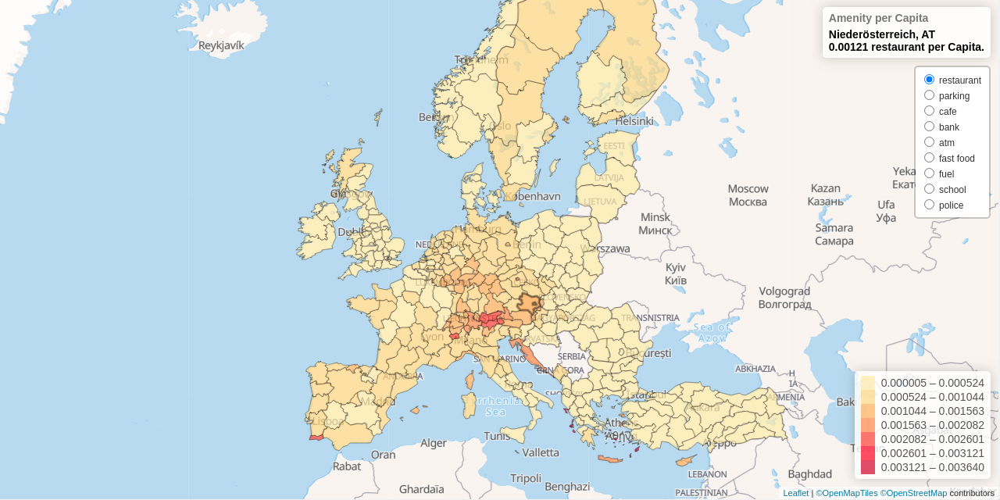

# Data Science with OpenStreetMap and Python

Project can be viewed on [apps.janakiev.com/osm-data-science](https://apps.janakiev.com/osm-data-science/).

[OpenStreetMap](https://www.openstreetmap.org/) (OSM) is a massive collaborative map of the world, built and maintained mostly by volunteers. On the other hand, there exist various indicators to measure economic growth, prosperity and produce of a country. What if we use OpenStreetMap to predict those economic indicators?

This project is covered in the following articles and notebooks
- [Predict Economic Indicators with OpenStreetMap](https://janakiev.com/blog/osm-predict-economic-indicators/)
- [Compare Countries and Cities with OpenStreetMap and t-SNE](https://janakiev.com/blog/osm-compare-countries-and-cities/)
- [Visualize the Graphical Structure of Countries by their Amenity Distributions](osm-amenity-graphical-structure.ipynb)

This project further explores the way how common data science methods can be applied on data from [OpenStreetMap](https://www.openstreetmap.org). The basis for the data were the counts of the most common amenities like restaurant, cafe, etc. (specified with [Key:amenity](https://wiki.openstreetmap.org/wiki/Key:amenity)) found on the various buildings and elements in OpenStreetMap. The interactive visualization is done with [leaflet.js](https://leafletjs.com/).

# Used Data Sets and APIs
- [Human Development Index and its components](http://hdr.undp.org/en/composite/HDI) and [Human Development Data (1990-2015)](http://hdr.undp.org/en/data)
- [World Bank Open Data](https://data.worldbank.org/) with [wbdata](https://github.com/OliverSherouse/wbdata) by Sherouse, Oliver (2014). Arlington, VA. Available from http://github.com/OliverSherouse/wbdata.
- [The Big Mac Index](https://www.economist.com/content/big-mac-index), data available in [TheEconomist/big-mac-data](https://github.com/TheEconomist/big-mac-data)
- [OpenStreetMap](https://www.openstreetmap.org/) and [Overpass API](https://wiki.openstreetmap.org/wiki/Overpass_API)
- [Taginfo](https://taginfo.openstreetmap.org/)

# License 
This project is licensed under the MIT license. See the [LICENSE](LICENSE) for details.
